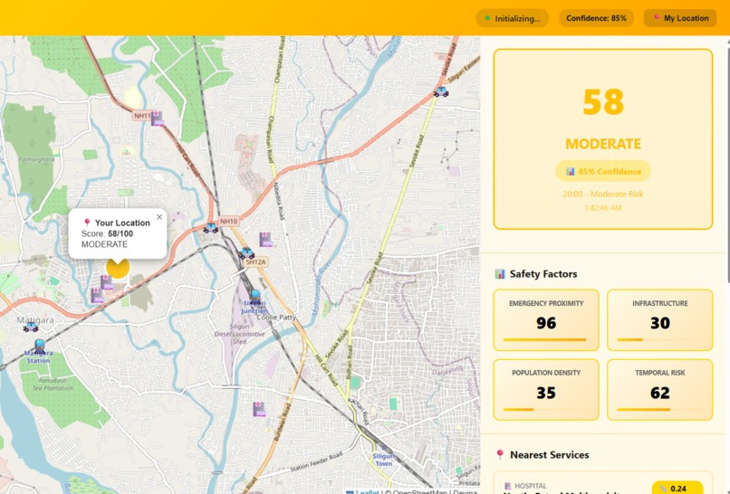

🌸Devina – A Context-Aware Women’s Safety Companion (Prototype)

 Devina is a prototype web application that explores how contextual, real-world signals can be combined into an interpretable safety indicator for a given location.
 The project focuses on system design, transparency, and reliability, rather than prediction accuracy or automation. It is intended as an exploratory and learning-oriented prototype, not a deployed safety product.

🧠 Motivation

Women’s safety is highly contextual and remains a significant concern in the region where I live, as well as globally. The same location can feel very different depending on factors such as time of day, surrounding activity, availability of emergency services, and infrastructure like lighting or public transport.

Many safety-related applications focus primarily on reactive alerts. Devina was built to explore a proactive, informational approach — helping users reason about their surroundings using clearly explained signals, while intentionally avoiding false certainty or overconfident predictions.

⚙️ How It Works 

Devina computes a safety score by combining four primary contextual signals:
*Temporal Risk
Time of day is used as a proxy for visibility and general activity levels.

*Emergency Proximity
Distance to nearby hospitals and police stations using open map data.

*Activity Density
Presence of shops, restaurants, and public venues as a proxy for human presence.

*Infrastructure Availability
Indicators such as street lighting and access to public transport.
Each signal contributes to a rule-based, weighted scoring system designed for clarity, explainability, and predictable behaviour.

🧩 System Architecture

#Frontend
A simple HTML interface for user interaction and visualization.

#Backend
A Flask-based server handling requests, validation, and real-time updates.

#Safety Engine
A dedicated logic module responsible for:
*External data retrieval
*Distance calculations
*Risk scoring
*Service availability detection

#Communication
*REST APIs for standard requests
*WebSockets for real-time updates

#Data Sources
*OpenStreetMap (via Overpass API)
*IP-based geolocation services

🧠 Design Philosophy

*Interpretability over black-box models
A rule-based approach was chosen instead of machine learning to keep the system explainable and auditable.

*Graceful degradation
When required data sources are unavailable, the system explicitly reports a service unavailable state instead of producing unreliable results.

*Separation of concerns
The application is structured into distinct layers (UI, backend, safety logic) to improve clarity, maintainability, and focused learning.

*Ethical caution
The system avoids framing outputs as guarantees and emphasizes context rather than prediction.

📚 WHAT I LEARNED:

Through this project, I explored and learned:

*Web application fundamentals (HTTP, REST APIs, client–server architecture)
*Backend development using Python and Flask
*Real-time systems using WebSockets
*External API integration and defensive programming
*Basic geospatial reasoning and distance calculations
*Rule-based scoring systems and reliability-focused design
*The learning process was problem-driven, with theory studied alongside practical implementation.

⚠️ Limitations & Ethical Notes

*The safety score is indicative, not a guarantee of personal safety.
*Data availability varies significantly by region.
*The system avoids making inferences when data is insufficient to reduce false confidence.
*This project is a prototype and is not intended for real-world deployment without expert review and validation.

🚀 Future Improvements

*Localized calibration using regional data
*User feedback integration
*Improved explainability of individual score components
*Offline and low-connectivity support
*Stronger privacy and data minimization practices!

